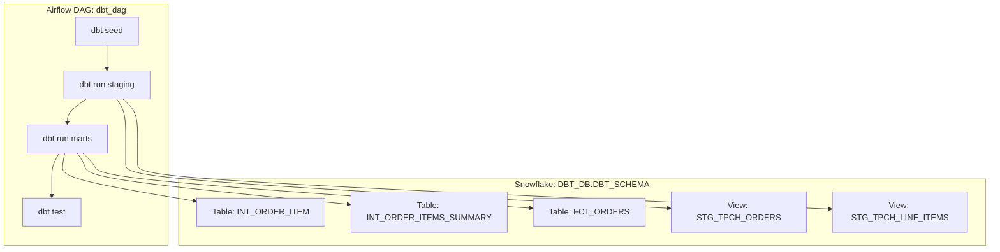

# 📊 dbt + Snowflake + Airflow (Cosmos) Demo

This project demonstrates an **end-to-end ELT pipeline** using:
- **dbt** for SQL-based transformations and testing
- **Snowflake** as the cloud data warehouse
- **Airflow (via Astronomer Cosmos)** for scheduling and orchestration

The pipeline loads seed data, transforms it into staging and marts models, validates results with dbt tests, and schedules everything through Airflow.

---

## 🚀 Project Overview

- **Database**: `DBT_DB`  
- **Schema**: `DBT_SCHEMA`  
- **Role**: `DBT_ROLE`  

## 🔄 Workflow in Detail

This project models data into Snowflake using **dbt**, organized as staging → marts → business views.

1. **Seed / Raw Data**
   - CSVs loaded into **DBT_DB.DBT_SCHEMA** using `dbt seed`.

2. **Staging Layer (Views in Snowflake)**
   - `stg_tpch_orders.sql` → materialized as view `STG_TPCH_ORDERS`
   - `stg_tpch_line_items.sql` → materialized as view `STG_TPCH_LINE_ITEMS`
   - These standardize and clean raw transactional data.

3. **Marts Layer (Tables in Snowflake)**
   - `fct_orders.sql` → fact table `FCT_ORDERS` with metrics like revenue, discount, order count.
   - `int_order_item.sql` → table `INT_ORDER_ITEM` joining staging models.
   - `int_order_items_summary.sql` → table `INT_ORDER_ITEMS_SUMMARY` aggregating line items at the order level.

4. **Business Views**
   - The marts tables serve as business-ready datasets that BI tools can query directly.

5. **Validation**
   - Schema tests (`tpch_sources.yml`, `generic_tests.yml`) ensure keys and constraints.
   - Custom tests (`fct_orders_data_valid.sql`, `fct_orders_discount.sql`) enforce business rules.

6. **Orchestration**
   - Airflow DAG (`dbt_dag`) runs the dbt workflow daily:
     - `dbt seed` → `dbt run (staging)` → `dbt run (marts)` → `dbt test`

---

## 📂 Repo Structure

### Data Flow in Snowflake

