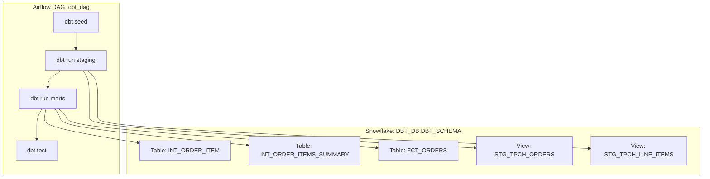

# 📊 dbt + Snowflake + Airflow (Cosmos) Demo

This project demonstrates an **end-to-end ELT pipeline** using:
- **dbt** for SQL-based transformations and testing
- **Snowflake** as the cloud data warehouse
- **Airflow (via Astronomer Cosmos)** for scheduling and orchestration

The pipeline loads seed data, transforms it into staging and marts models, validates results with dbt tests, and schedules everything through Airflow.

---

## 🚀 Project Overview

- **Database**: `DBT_DB`  
- **Schema**: `DBT_SCHEMA`  
- **Role**: `DBT_ROLE`  

### Workflow
1. **Seed Data** → CSVs loaded into Snowflake (`dbt seed`)  
2. **Staging Models** → clean + standardize raw data (`models/staging/`)  
3. **Marts Models** → transform staging into business-level facts/dimensions (`models/marts/`)  
4. **Business Views** → exposed to BI/analytics tools  
5. **Validation** → dbt schema + custom tests  
6. **Orchestration** → Airflow DAG (`dbt_dag`) runs the dbt workflow on a schedule  

---

## 📂 Repo Structure

### Data Flow in Snowflake

