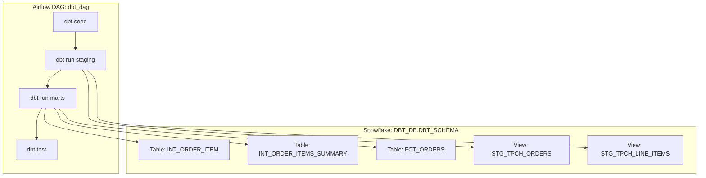

# 📊 dbt + Snowflake + Airflow (Cosmos) Demo

This project demonstrates an **end-to-end ELT pipeline** using:
- **dbt** for SQL-based transformations and testing
- **Snowflake** as the cloud data warehouse
- **Airflow (via Astronomer Cosmos)** for scheduling and orchestration

The pipeline loads seed data, transforms it into staging and marts models, validates results with dbt tests, and schedules everything through Airflow.

---

## 🚀 Project Overview

- **Database**: `DBT_DB`  
- **Schema**: `DBT_SCHEMA`  
- **Role**: `DBT_ROLE`  

## 🔄 Workflow in Detail

This project models data into Snowflake using **dbt**, organized as staging → marts → business views.

1. **Seed / Raw Data**
   - CSVs loaded into **DBT_DB.DBT_SCHEMA** using `dbt seed`.

2. **Staging Layer (Views in Snowflake)**
   - `stg_tpch_orders.sql` → materialized as view `STG_TPCH_ORDERS`
   - `stg_tpch_line_items.sql` → materialized as view `STG_TPCH_LINE_ITEMS`
   - These standardize and clean raw transactional data.

3. **Marts Layer (Tables in Snowflake)**
   - `fct_orders.sql` → fact table `FCT_ORDERS` with metrics like revenue, discount, order count.
   - `int_order_item.sql` → table `INT_ORDER_ITEM` joining staging models.
   - `int_order_items_summary.sql` → table `INT_ORDER_ITEMS_SUMMARY` aggregating line items at the order level.

4. **Business Views**
   - The marts tables serve as business-ready datasets that BI tools can query directly.

5. **Validation**
   - Schema tests (`tpch_sources.yml`, `generic_tests.yml`) ensure keys and constraints.
   - Custom tests (`fct_orders_data_valid.sql`, `fct_orders_discount.sql`) enforce business rules.

6. **Orchestration**
   - Airflow DAG (`dbt_dag`) runs the dbt workflow daily:
     - `dbt seed` → `dbt run (staging)` → `dbt run (marts)` → `dbt test`

---

## 📂 Repo Structure
```
DBT-DAG/
├── dags/
│ ├── dbt_dag.py # Cosmos DAG definition
│ └── dbt/data_pipeline/ # dbt project
│ ├── dbt_project.yml
│ ├── models/
│ │ ├── staging/
│ │ │ ├── stg_tpch_orders.sql
│ │ │ └── stg_tpch_line_items.sql
│ │ └── marts/
│ │ ├── fct_orders.sql
│ │ ├── int_order_item.sql
│ │ └── int_order_items_summary.sql
│ ├── seeds/
│ ├── snapshots/
│ ├── macros/
│ └── tests/
├── requirements.txt
├── astro-project.yaml
└── README.md
```
---

## 🗂️ Architecture Diagrams


### Data Flow in Snowflake



### Airflow DAG Orchestration

```mermaid
flowchart TD
  T1[dbt seed]
  T2[dbt run (staging)]
  T3[dbt run (marts)]
  T4[dbt test]

  T1 --> T2 --> T3 --> T4
```

---

## ⚙️ Setup Instructions

Follow these steps to run the project locally with Astronomer and Snowflake.

### 1. Install prerequisites
- [Docker Desktop](https://www.docker.com/products/docker-desktop)  
- [Astronomer CLI](https://www.astronomer.io/docs/astro/cli/install-cli)  

### 2. Clone the repository
```bash
git clone https://github.com/<your-username>/dbt-snowflake-airflow-demo.git
cd dbt-snowflake-airflow-demo
```

### 3. Start Airflow locally
```bash
astro dev start
Airflow UI → http://localhost:8080
Postgres (default metadata DB) is available at localhost:5432
```

### 4. Configure Snowflake connection in Airflow

In the Airflow UI → **Admin → Connections → + Add a new record**, fill out the form as follows:

- **Conn Id**: `snowflake_conn`  
- **Conn Type**: `Snowflake`  
- **Login**: `<your_snowflake_user>`  
- **Password**: `<your_password>`  
- **Schema**: `DBT_SCHEMA`  

For the **Extra (JSON)** field, add your Snowflake details:

```json
{
  "account": "youraccount.us-east-1",
  "warehouse": "ANALYTICS_WH",
  "database": "DBT_DB",
  "role": "DBT_ROLE"
}
```

### 5. Trigger the DAG

- In the Airflow UI, enable the DAG **`dbt_dag`**.  
- This will automatically run the following pipeline steps:

  1. `dbt seed` → load seed data into Snowflake  
  2. `dbt run` (staging) → build staging views (`STG_TPCH_ORDERS`, `STG_TPCH_LINE_ITEMS`)  
  3. `dbt run` (marts) → build marts tables (`FCT_ORDERS`, `INT_ORDER_ITEM`, `INT_ORDER_ITEMS_SUMMARY`)  
  4. `dbt test` → validate data with schema + custom tests  

---

### 6. Inspect results

- ✅ **Airflow** → DAG run completes successfully, with logs visible for each task  
- ✅ **Snowflake** → new objects created under `DBT_DB.DBT_SCHEMA`  
  - Views: `STG_TPCH_ORDERS`, `STG_TPCH_LINE_ITEMS`  
  - Tables: `FCT_ORDERS`, `INT_ORDER_ITEM`, `INT_ORDER_ITEMS_SUMMARY`  
- ✅ **dbt tests** → confirm data quality (e.g., `not_null`, `unique`, business rule checks)  
